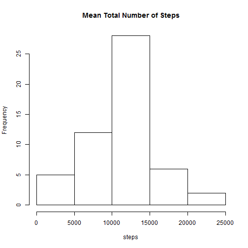
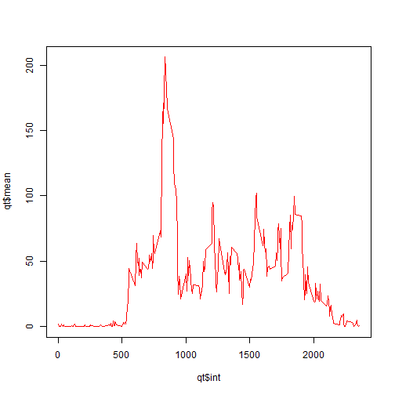
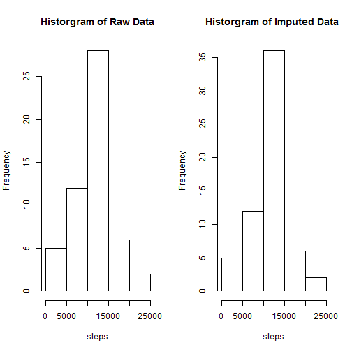
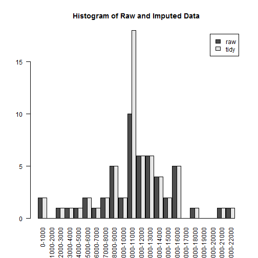
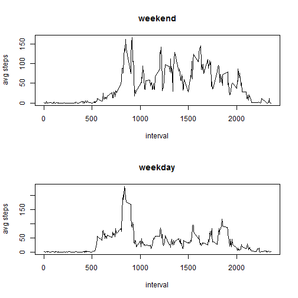

# Module 5 Reproducible Research - Peer Assessment 1

## Introduction
It is now possible to collect a large amount of data about personal movement using activity monitoring devices such as a Fitbit, Nike Fuelband, or Jawbone Up. These type of devices are part of the "quantified self" movement - a group of enthusiasts who take measurements about themselves regularly to improve their health, to find patterns in their behavior, or because they are tech geeks. But these data remain under-utilized both because the raw data are hard to obtain and there is a lack of statistical methods and software for processing and interpreting the data.

## This exercise
This assignment makes use of data from a personal activity monitoring device. This device collects data at 5 minute intervals through out the day. The data consists of two months of data from an anonymous individual collected during the months of October and November, 2012 and include the number of steps taken in 5 minute intervals each day.

## Data
The variables included in this dataset are:
- steps: Number of steps taken in a 5-minute interval (missing values as NA)
- date: The data on which the measurement was taken in YYY-MM-DD format
- interval: Identifier for the 5-minute interval in which the measurement was taken

## Required libraries

```r
library(dplyr)
library(lubridate)
library(knitr)
opts_chunk$set(fig.path='./figure/')
```

## Loading and preprocessing the data

```r
dfrData <- read.csv("activity.csv")
```

## What is mean total number of steps taken per day?

```r
dfrByDate <- group_by(dfrData,date)
qd <- summarise(dfrByDate,sum(steps))
hist(qd$sum, xlab="steps", main="Mean Total Number of Steps")
```

 

```r
summary(qd$sum)
```

```
##    Min. 1st Qu.  Median    Mean 3rd Qu.    Max.    NA's 
##      41    8841   10760   10770   13290   21190       8
```

The mean is 10770 steps a day. Making 10,000 steps a day is recommend by many [health associations](http://www.nhs.uk/Livewell/loseweight/Pages/10000stepschallenge.aspx)

## What is the average daily activity pattern?

```r
dfrInt <- group_by(dfrData, interval)
qt <- summarise(dfrInt,mean(steps,na.rm=TRUE))
plot(qt$int,qt$mean,type="l",main="Average Daily Activity Pattern", xlab="Interval", ylab="Average Steps")
```

 

```r
m <- which.max(qt$mean)
qt$interval[m]
```

```
## [1] 835
```

Around 8:35am is soon to be on average the most active part of the day. 

## Imputing missing values
Missing data (indicated as NA) are imputed, i.e. replaced by a meaningful value.
For this part we will replace the missing value on a day for a given interval by the mean across all days for the interval.
We will analyze the impact of imputing values on the dataset by looking at some descriptive parameters of the set.

```r
m <- dfrData[!complete.cases(dfrData),]
nrow(m)
```

```
## [1] 2304
```

```r
nrow(m)/nrow(dfrData)
```

```
## [1] 0.1311475
```

Roughly 13% of the observations containg missing data.


```r
# if value is missing in raw data dfrData, obtain the corresponding interval ID
# match the interval ID in the summary to obtain the observation number
# use the observation number to obtain the mean value
# replace the missing value with the mean value
dfrTidy <- dfrData
for (i in 1:nrow(dfrTidy)){
    if (is.na(dfrTidy$steps[i])){ dfrTidy$steps[i] <- qt$mean[match(dfrTidy$interval[i],qt$interval)]}
}
plot(qt$int,qt$mean,type="l")
points(qtTidy$int,qtTidy$mean,type="l",col="red", xlab="Interval", ylab="Average Steps")
```

 

```r
## what is the impact of imputing missing values
qtd <- summarise(group_by(dfrTidy,date),sum(steps))
summary(qd$sum)
```

```
##    Min. 1st Qu.  Median    Mean 3rd Qu.    Max.    NA's 
##      41    8841   10760   10770   13290   21190       8
```

```r
summary(qtd$sum)
```

```
##    Min. 1st Qu.  Median    Mean 3rd Qu.    Max. 
##      41    9819   10770   10770   12810   21190
```
For the imputed data the median is higher while the mean is equal.
The 1st Quantile is higher while the 3rd is lower, suggesting a slightly shifted distribution.
To that end both distributions are depicted in a single plot below.

```r
par(mfrow=c(1,2))
hist(qd$sum,main = "Historgram of Raw Data",xlab="steps")
hist(qtd$sum, main ="Historgram of Imputed Data ",xlab="steps")
```

 

```r
par(mfrow=c(1,1))

# show it together
## Prepare data for input to barplot
breaks <- pretty(range(c(qd$sum, qtd$sum),na.rm=TRUE), n=20)
D1 <- hist(qd$sum, breaks=breaks, plot=FALSE)$counts
D2 <- hist(qtd$sum, breaks=breaks, plot=FALSE)$counts
dat <- rbind(D1, D2)
colnames(dat) <- paste(breaks[-length(breaks)], breaks[-1], sep="-")

## Plot it
barplot(dat, beside=TRUE, space=c(0, 0.1), las=2,legend.text=c("raw","tidy"),main="Histogram of Raw and Imputed Data")
```

 

As a result of our imputing strategy, replacing missing values by the mean, we note that the frequency around the mean value has increased.

## Are there differences in activity patterns between weekdays and weekends?
Monday through Friday are denoted was 'weekday', while Saturday and Sunday as 'weekend'.
A plot is produced containing a time series of the 5-minute interval (x-axis) and the average number of steps, averaged across all weekday or weeknd days (y-axis).

```r
wdc <- weekdays(as.Date(dfrTidy$date))
wdc[wdc=="Saturday"] <- "weekend"
wdc[wdc=="Sunday"] <- "weekend"
wdc[wdc!="weekend"] <- "weekday"
dfrX <- cbind(dfrTidy,cat=wdc)
qtc1 <- summarise(subset(group_by(dfrX,interval),cat=="weekend"),mean(steps))
qtc2 <- summarise(subset(group_by(dfrX,interval),cat=="weekday"),mean(steps))
par(mfrow=c(2,1))
plot(qtc1$interval,qtc1$mean,type="l",main="weekend",xlab="interval",ylab="avg steps")
plot(qtc2$interval,qtc2$mean,type="l",main="weekday",xlab="interval",ylab="avg steps")
```

 

```r
par(mfrow=c(1,1))
```

Some observations following the anaysis of the plots:
- Weekdays suggest an earlier in the day activity pattern, followed by a peak and then relative in-activity throughout the day.
- Weekends tend to become more active later in the day while staying more active throughout the entire day.
- Assuming our subject in a working class citizen this might indicate a normal pattern. 
